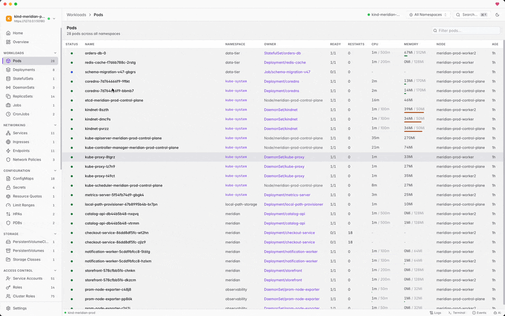

<div align="center">

# Clusterfudge

**A fast, native desktop app for browsing and debugging Kubernetes clusters.**

22 MB binary. Zero telemetry. MIT licensed.

[](LICENSE)
[](https://github.com/leonardaustin/clusterfudge/stargazers)
[](https://github.com/leonardaustin/clusterfudge/releases)
[](https://github.com/sponsors/leonardaustin)



</div>

---

Clusterfudge combines the speed of a terminal with the clarity of a GUI. Built with Go and [Wails](https://wails.io) instead of Electron — it starts instantly, uses ~80 MB of RAM, and never phones home.

Works with any Kubernetes distribution: EKS, GKE, AKS, K3s, OpenShift, kind, and more.

## Install

### Homebrew (macOS / Linux)

```bash
brew install --cask leonardaustin/tap/clusterfudge
```

### APT (Debian / Ubuntu)

```bash
curl -fsSL https://apt.austincorp.com/pubkey.gpg | sudo gpg --dearmor -o /usr/share/keyrings/austincorp.gpg
echo "deb [signed-by=/usr/share/keyrings/austincorp.gpg] https://apt.austincorp.com stable main" | sudo tee /etc/apt/sources.list.d/austincorp.list
sudo apt update && sudo apt install clusterfudge
```

### Direct Download

Grab the latest release from the [Releases](https://github.com/leonardaustin/clusterfudge/releases) page:

- **macOS** — `.dmg` (Apple Silicon & Intel)
- **Linux** — `.tar.gz` (x64 & ARM64)

## Features

### Cluster Management
- **Multi-cluster** — connect to multiple clusters, switch contexts, monitor health at a glance
- **27+ resource types** — Pods, Deployments, Services, Secrets, CRDs, and more with real-time watch updates
- **Resource actions** — scale, restart, cordon/uncordon, drain nodes, pause/resume rollouts
- **Deployment wizards** — form-based creation for Deployments, Services, ConfigMaps, Secrets

### Debugging & Operations
- **Log streaming** — real-time tail with regex search, severity coloring, multi-container support, download
- **Interactive terminal** — exec into containers with full PTY, ANSI color, and resize support
- **Port forwarding** — centralized dashboard with auto-reconnection and status monitoring
- **Troubleshooting engine** — guided root cause analysis for CrashLoopBackOff, OOMKilled, ImagePullBackOff, Pending pods
- **AI debugging** — one-click context gathering (logs, events, YAML) with automatic secret redaction, launches your preferred AI CLI tool

### Helm
- **Full lifecycle management** — install, upgrade, rollback, uninstall via embedded Helm SDK (no CLI dependency)

### Security & Compliance
- **Security scanning** — Pod Security Standards checker
- **RBAC visualization** — graph-based relationship viewer
- **Audit trail** — file-backed logging for secret access and mutating operations
- **Backup/restore** — export resources with metadata stripping

### UX
- **Command palette** — Cmd+K fuzzy search across everything
- **Keyboard-first** — vim-style chord navigation, table shortcuts
- **YAML editor** — Monaco-based with Kubernetes schema validation and dry-run diff preview
- **Dark/light themes** — system preference detection, accent color customization
- **Alerting** — configurable alert rules with acknowledgement

## How It Compares

| | Clusterfudge | Lens | K9s | Headlamp | FreeLens |
|---|---|---|---|---|---|
| **Binary size** | ~22 MB | ~150 MB | ~30 MB | ~120 MB | ~150 MB |
| **Runtime** | Native (Wails/Go) | Electron | Terminal | Electron | Electron |
| **Telemetry** | None | Yes | None | Optional | None |
| **Helm** | Embedded SDK | CLI wrapper | CLI wrapper | Plugin | CLI wrapper |
| **Security scanning** | Built-in | Extension | No | Plugin | No |
| **License** | MIT | Proprietary | Apache 2.0 | Apache 2.0 | MIT |
| **Forced login** | No | Yes | No | No | No |

## Tech Stack

- **Backend:** Go with [Wails v2](https://wails.io) — native OS webview, no bundled browser
- **Frontend:** React + TypeScript
- **Kubernetes:** Official [client-go](https://github.com/kubernetes/client-go) library
- **Helm:** Embedded [Helm SDK](https://helm.sh) — no CLI dependency
- **Editor:** [Monaco](https://microsoft.github.io/monaco-editor/) with Kubernetes schema validation

## Contributing

See [CONTRIBUTING.md](CONTRIBUTING.md).

## License

MIT — see [LICENSE](LICENSE).
